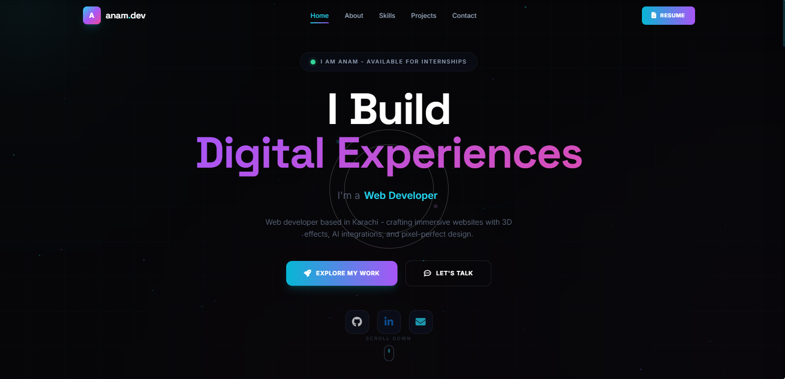
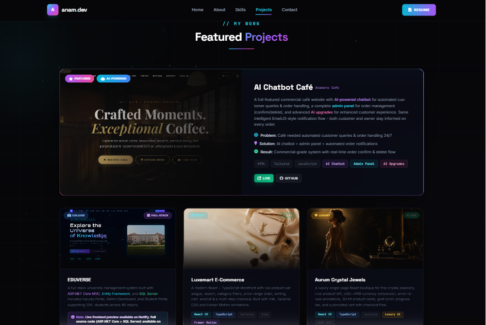
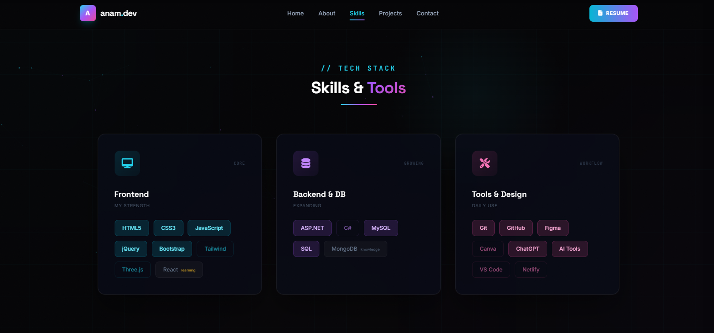

# 👩‍💻 Anam Khan — Web Developer Portfolio

Welcome to my personal portfolio — a showcase of the web applications, e-commerce platforms, and full-stack projects I've built using modern JavaScript frameworks, backend technologies, and AI integrations.

🔗 **Live Site:** [anam-portfoliio.netlify.app](https://anam-portfoliio.netlify.app)

---

## 🖼️ Preview

*Homepage — hero section*

*Projects section — case-study style cards for each build*

*Skills section — tech stack organized by Frontend, Backend & DB, and Tools*

<!--
👉 How this works:
All three images live in a "screenshots" folder in this repo (same level as this README):
  screenshots/homepage.png
  screenshots/projects.png
  screenshots/skills.png
Upload them with those exact names and they'll render automatically on GitHub.
-->

---

## 🧑‍🎓 About Me

I'm a Web Developer currently pursuing an **Advanced Diploma in Software Engineering (ADSE)** at Aptech Learning, Karachi, specializing in Web Development, ASP.NET, Database Management, and AI Studies. I build full-stack applications end-to-end — from responsive frontends to secure backends and databases — and have delivered live freelance projects for real clients on schedule.

I'm currently seeking an **internship** to apply my frontend skills and grow as a full-stack developer.

---

## 🛠️ Tech Stack

**Frontend**
`HTML5` `CSS3` `JavaScript` `React` `TypeScript` `jQuery` `Bootstrap` `Tailwind CSS` `Three.js` `Vite` `Framer Motion`

**Backend**
`ASP.NET Core MVC` `C#` `Entity Framework` `Node.js` `Express.js`

**Database**
`SQL Server` `MySQL` `MongoDB`

**Tools & Platforms**
`Git` `GitHub` `VS Code` `Figma` `Netlify` `Postman`

**AI & Integrations**
`AI Chatbot Integration` `EmailJS` `REST APIs` `JWT Auth`

---

## 🚀 Featured Projects

| Project | Description | Live Link |
|---|---|---|
| **AI Chatbot Cafe** | Commercial cafe website with an AI-powered chatbot and admin panel for order management. | [Visit](https://anamora-cafe.netlify.app) |
| **LUXEMART E-Commerce Store** | React + TypeScript storefront with product catalogue, search, filters, cart, wishlist, and multi-step checkout. | [Visit](https://luxemart-ecommerce-store.netlify.app) |
| **Aurum Crystal Jewels** | Luxury React boutique with live product API, USD–PKR conversion, 3D tilt cards, and scroll-reveal animations. | [Visit](https://aurum-crystal-jewels.netlify.app) |
| **Employee Management System** | MERN Stack app with role-based access (Admin, HR, Manager, Employee) covering Auth, Payroll, Attendance, Leave, and Reports. | [GitHub](https://github.com/anamkhan2007/Employee-Management-System) |
| **EduVerse** | Full-stack university management system (ASP.NET Core MVC + Entity Framework + SQL Server) scaling to 12K+ students across 48 majors. | [Visit](https://eduverse-university.netlify.app) |
| **Al Saudia Ajwa** | Live e-commerce site for a real client with online ordering, Cash on Delivery, and EmailJS order-confirmation emails. | [Visit](https://alsaudia-ajwa.netlify.app) |
| **Marie Curie Biography** | Immersive 3D animated biography site with CSS hover effects, jQuery animations, and JSON-driven content. | [Visit](https://marie-curiee.netlify.app) |
| **Pakistan Recipe Finder** | Recipe discovery platform featuring 24+ authentic recipes from all four provinces of Pakistan. | [Visit](https://reciipe-finder.netlify.app) |

---

## 💡 Why Work With Me

- ✅ Clean, maintainable, well-documented code
- ✅ On-time delivery, even under tight deadlines
- ✅ Strong client communication and requirement-gathering
- ✅ Creative, detail-oriented UI/UX design
- ✅ Self-motivated learner, always exploring emerging tech (AI, MERN Stack)

---

## 📫 Let's Connect

- 🌐 Portfolio: [anam-portfoliio.netlify.app](https://anam-portfoliio.netlify.app)
- 💼 LinkedIn: [linkedin.com/in/anam-khan-9b264541a](https://linkedin.com/in/anam-khan-9b264541a)
- 🐙 GitHub: [github.com/anamkhan2007](https://github.com/anamkhan2007)
- 📧 Email: anamsaeed2007@gmail.com
- 📞 WhatsApp: +92 333 3641847

---

⭐ If you like what you see, feel free to star this repo or reach out — I'm open to internship opportunities and collaborations!
